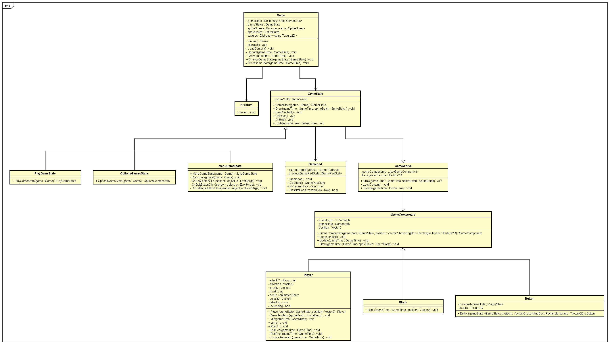

Contents

[Introduction. 2](#_Toc102307868)

[Game idea. 2](#_Toc102307869)

[Frameworks, libraries,  and other supporting material that will be used. 2](#_Toc102307870)

[Schedule. 2](#_Toc102307871)

[MSCW analysis. 3](#_Toc102307872)

[Appendix. 4](#_Toc102307873)

[Reference games. 4](#_Toc102307874)

[Assets. 5](#_Toc102307875)

[Literature. 5](#_Toc102307876)

# Introduction

This is a start document for the C# end-assignment, in which the student group has decided to create a game. The game idea, frameworks and libraries that are planned to be used, planned development schedule, and helpful literature and reference material will be provided in this document.

# Game idea

The idea of the game is to create a 2D fighter game, which features local co-op and can be played by up to four players. The game will support different controllers from different brands and will be played synchronously on one screen.

The fighting game will feature multiple playable characters with slightly different stats behind them, to vary up the primary gameplay loop. However, the characters will all have the same basic attacks, namely a kick and a punch uninfluenced by the movement of said characters.

The game will have a way of defeating the other players if their health bar reaches zero. This will trigger a state where the affected player will not be able to continue playing and the game will be won if only one person is left standing.

The art-style of the game will be pixelated, not confined to a style like 16-bit.

# Class diagram

# Frameworks, libraries, and other supporting material that will be used

Since .NET and C# are requirements for this project, the Monogame library will be used[[RS1\]](#_msocom_1) . It is based on Microsoft’s XNA Framework and is focused on creating games for desktop PCs, video game consoles, and mobile devices.

A multitude of art, animation and audio assets will be used, either directly or as inspiration for group’s own work. An example of some of these assets that may be used will be provided in the appendix at the end of the document.

# Schedule

The group is expected to spend about 84 hours each across a period of 9 weeks. This schedule tries to approximate the progress that the group will do with development of the game on a weekly basis. The scheduling is for the group as a whole, not detailing the individual tasks per person.

| **Code** | **Task**                               | **Week** | **Predecessors** |
| -------- | -------------------------------------- | -------- | ---------------- |
| **A**    | Code of  conduct                       | 1        |                  |
| **B**    | Moscow  analysis                       | 1        | A                |
| **C**    | Start  document                        | 2        | B                |
| **D**    | Learn Monogame  basics                 | 3        | C                |
| **E**    | Class diagram                          | 3        | D                |
| **F**    | Basic level and  camera implementation | 3        | E                |
| **G**    | Basic  character implementation        | 3        | E                |
| **H**    | Character  movement and attacks        | 4        | G                |
| **I**    | Hitbox and  character interaction      | 4        | H                |
| **J**    | Character  stats                       | 5        | I                |
| **K**    | Controller  input                      | 5        | F, J             |
| **L**    | Game settings                          | 5        | F, J             |
| **M**    | Map selector  and other maps           | 6        | K, L             |
| **N**    | Character  designs                     | 6        | M                |
| **O**    | Animations                             | 6        | N                |
| **P**    | Final game  testing and code cleanup   | 8        | M                |
| **Q**    | Special  attacks and additional moves  | 8        | P                |
| **R**    | Other  additional features             | 8        | Q                |

 

|      | Week 1 | Week 2 | Week 3 | Week 4 | Week 5 | Week 6 | Week 7 | Week 8 | Week 9 |
| ---- | ------ | ------ | ------ | ------ | ------ | ------ | ------ | ------ | ------ |
| A    |    -   |        |        |        |        |        |        |        |        |
| B    |    -   |        |        |        |        |        |        |        |        |
| C    |        |    -   |        |        |        |        |        |        |        |
| D    |        |        |    -   |        |        |        |        |        |        |
| E    |        |        |    -   |        |        |        |        |        |        |
| F    |        |        |    -   |        |        |        |        |        |        |
| G    |        |        |    -   |    -   |        |        |        |        |        |
| H    |        |        |        |    -   |    -   |        |        |        |        |
| I    |        |        |        |    -   |    -   |        |        |        |        |
| J    |        |        |        |        |    -   |        |        |        |        |
| K    |        |        |        |        |    -   |    -   |        |        |        |
| L    |        |        |        |        |    -   |    -   |        |        |        |
| M    |        |        |        |        |        |    -   |        |        |        |
| N    |        |        |        |        |        |    -   |        |        |        |
| O    |        |        |        |        |        |    -   |    -   |    -   |        |
| P    |        |        |        |        |        |        |        |    -   |    -   |
| Q    |        |        |        |        |        |        |        |    -   |    -   |
| R    |        |        |        |        |        |        |        |    -   |    -   |

# MSCW analysis

Must have:

\-     Splash / Load screen

\-     Game start screen

\-     Character selector

\-     Level selector

\-     Pause screen

\-     4 playable character

\-     Character stats

	o  Damage

	o  Attack speed

	o  Movement speed

\-     Punch attack

\-     Kick attack

\-     Player movement

	o  Jump

\-     Health bar

\-     Death when health == 0

\-     Map

\-     Camera

\-     Hitbox

\-     Hit detection

\-     Multiple (up-to-four) Controller input detection

\-     2D Sprite sheets for character animation, specified below

\-     Animations

	o  Attack animations

	o  Movement animation

Should have: 

\-     Game Settings screen

	o  Music levels

	o  Sound effect levels

\-     Map selector

	o  Multiple maps

\-     Set timer to limit game round time

\-     Sudden death mechanics

\-     Animations

	o  Death animation

	o  Running animation

	o  Resting / idle animation

	o  Damage indicators

Could have:

\-     Special attacks per playable character

\-     Player knockback (separate stat?)

\-     Player double jump?

\-     Environment interaction

\-     Power ups

\-     Game settings screen

	o  Keymapping

\-     Life setter

\-     Double jump

\-     Time limit setter

\-     Environmental hazards

\-     Cheat codes

\-     Additional attacks

\-     Air attacks

\-     Team selector (2 v 2?)

\-     Crouch movement

\-     Death when of screen

Won't have:

\-     Additional weapons

\-     Bot / AI enemies

\-     Regenerative health

# Appendix

## Reference games

These games will be used as inspiration for either gameplay or art

https://www.smashbros.com/en_GB/index.html

https://store.steampowered.com/app/291550/Brawlhalla/

https://store.steampowered.com/app/383980/Rivals_of_Aether/

https://store.steampowered.com/app/851100/Touhou_Luna_Nights/

## Assets

Some examples of assets that may be used for the game

https://beepyeah.itch.io/8-bit-sfx-pack

https://like100bears.itch.io/bearfx-explosions

https://beowulf.itch.io/rpg-boss-monsters-minions-huge-pack

https://shoehead.itch.io/lifter-8bit-cyber-platformer-pack

https://cleancutgames.itch.io/pixelart-fantasy-characters

## Literature

Branicki, D. (2017). Basic 2D Platformer Physics. https://gamedevelopment.tutsplus.com. Retrieved on May 1, 2022 from https://gamedevelopment.tutsplus.com/series/basic-2d-platformer-physics--cms-998

GamesFromScratch. (2015). MonoGame Tutorial Series. https://gamefromscratch.com. Retrieved on May 1, 2022 from https://gamefromscratch.com/monogame-tutorial-series/

Monogame.Monogame tutorial. https://docs.monogame.net. Retrieved on May 1, 2022 from https://docs.monogame.net/articles/getting_started/3_understanding_the_code.html

------